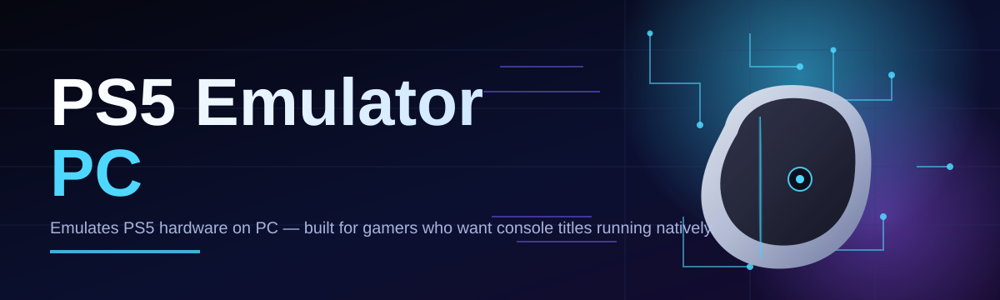
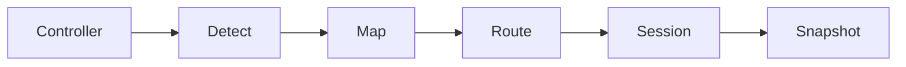

# ps5-emulator-controller 🎮🕹️

  

*A control layer that turns your PC into a PS5-grade playground — no console required.*

  

## 🧭 Overview

`ps5-emulator-controller` is the connective tissue between a modern Windows PC and PS5-class gameplay. It doesn't pretend to be a console — it behaves like one, translating input, output, and system signals into something your library of PS5 titles can actually understand. The project exists because the gap between "owning a game" and "playing a game" has grown wider every generation, and PC hardware has quietly become powerful enough to close that gap.

This tool is built for three kinds of people: emulation tinkerers who like knowing exactly what's happening under the hood, streamers who need a stable and repeatable setup, and everyday players who just want their favorite PS5 titles running on the machine they already own. There's no console tax, no proprietary lock-in — just a controller layer, a clean interface, and a workflow that respects your time.

Unlike sprawling all-in-one emulation suites, `ps5-emulator-controller` stays narrow on purpose. It focuses on input mapping, session control, and performance visibility — the parts of the PS5 emulator PC experience that are hardest to get right and easiest to take for granted when they work.

> [!NOTE]
> This project is a controller and orchestration layer. It does not distribute, host, or bundle any game content.

---

## ⚡ What It Actually Does

- **Adaptive input mapping** — DualSense-style triggers, gyro, and haptics get translated into PC-native signals without you touching a config file.

- **Session snapshots** — pause a play session and resume it later with state, mappings, and window layout intact.

- **Live performance overlay** — frame timing, thermals, and controller latency rendered in a corner overlay that never steals focus.

- **Profile-per-title memory** — the controller remembers button layouts and deadzones per game, so you set it once.

- **Zero-dependency runtime** — a single executable, no runtime installers, no background services fighting for startup priority.

- **Hot-swap controller detection** — unplug, reconnect, switch input devices mid-session without restarting anything.

- **Diagnostic export** — one click produces a shareable log bundle for troubleshooting or community support threads.

- **Dark-first interface** — designed for long sessions, low glare, and late-night debugging.

> [!TIP]
> Create a profile before your first launch. It takes under a minute and saves you from re-mapping triggers every session.

---

## 🚀 Getting Started

1. Visit the landing page using the download button above.

2. Download the standalone package for Windows.

3. Run the executable — no installer wizard, no bundled toolbars.

4. Connect your controller, select or create a profile, and launch your session.

> [!IMPORTANT]
> Run the tool from a folder with write permissions. Session snapshots and logs are stored next to the executable.

---

## 🖥️ System Requirements

| Component | Minimum | Recommended |
|---|---|---|
| OS | Windows 10 (64-bit) | Windows 11 (64-bit) |
| CPU | 4-core, 3.0 GHz | 6-core, 3.5 GHz+ |
| RAM | 8 GB | 16 GB |
| GPU | DirectX 12 capable | Dedicated GPU, 4 GB VRAM+ |
| Storage | 500 MB free | 2 GB free (for logs & snapshots) |
| Dependencies | None | None |

  

---

## 🏗️ How It Works

The controller sits between your input device and the emulation environment, acting as a translator rather than a middleman.

1. **Detect** — the tool scans for connected controllers and known input signatures.

2. **Map** — raw input is converted into a normalized profile the emulator layer expects.

3. **Route** — mapped signals are streamed to the active session in real time.

4. **Monitor** — the overlay tracks latency and frame health throughout play.

5. **Snapshot** — on exit, session state is written to disk for the next launch.

---

## 🧩 Common Pitfalls

**My controller isn't detected on launch.**
Reconnect the device after the app window opens — detection runs on a short polling cycle, not just at boot.

**Input feels delayed compared to native play.**
Close background overlays (chat apps, recording tools) that also hook into controller input. Overlap causes queuing delay.

**Snapshots won't resume correctly.**
Snapshots are tied to the executable's folder path. Moving the app after saving a session breaks the reference.

**The performance overlay shows no data.**
Some GPU drivers block overlay hooks by default. Enable third-party overlays in your GPU control panel.

**Profiles disappear after an update.**
Profiles are stored separately from the executable. If they're missing, check that antivirus quarantine didn't flag the profile folder.

**Windows flags the executable on first run.**
This is common for unsigned indie tools. Verify the download came from the official landing page before proceeding.

---

## 🎨 Interface & Interaction

- **Themes** — Midnight (default), Slate, and High Contrast, switchable from the settings panel.

- **Keyboard shortcuts:**

View shortcut reference

| Action | Shortcut |
|---|---|
| Open settings | `Ctrl + ,` |
| Toggle overlay | `F9` |
| New profile | `Ctrl + N` |
| Save snapshot | `Ctrl + S` |
| Force controller rescan | `Ctrl + R` |
| Export diagnostics | `Ctrl + Shift + D` |

- **Settings persistence** — every toggle is saved instantly, no "Apply" button required.

> [!WARNING]
> Switching themes mid-session briefly redraws the overlay. Save your snapshot first if you're mid-play.

---

## 🤝 Contributing & Community

Contributions are welcome — from typo fixes to controller mapping profiles for niche hardware. Open an issue before large changes so the direction can be discussed early.

- Fork the repository and branch from `main`.

- Keep commits scoped and descriptive.

- Reference related issues in your pull request description.

- Community discussion happens in the repository's Discussions tab — bug reports go in Issues.

 

---

## 📜 License

Released under the [MIT License](LICENSE), 2026.

---

## ⚠️ Disclaimer

> This project is an independent, community-built input controller for PC-based emulation workflows. It is not affiliated with, endorsed by, or connected to Sony Interactive Entertainment. Users are responsible for ensuring their use of any emulation software complies with local law and the terms governing any content they use it with.

